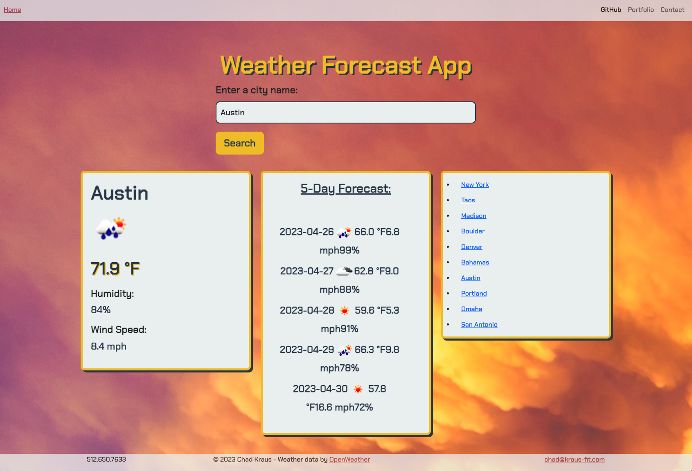

# Weather-Dashboard
A searchable, weather forecast application.

## Description

This webpage provides a Weather Forecast Dashboard with third-party weather data provided by OpenWeather via an API key. When the user views the webpage, they can search for a city by name and then they are shown the current weather forecast, including temperature, humidity, and wind speed. The API key also calls for the next 5 days of forecasted weather data to be displayed after the city has been searched. Additionally, the 10 previously searched cities are stored within local storage and displayed as clickable links for the user to revisit with updated weather data. This website also includes a navigation bar with clickable links leading the user to my GitHub profile, personal portfolio, and provides the ability to send an email directly to me. The webpage also includes a footer with contact information, copyright disclaimer, and the web API data source.

[Deployed App](https://chadkraus87.github.io/Weather-Dashboard)

## Installation

No installation necessary for this application. If you would like to use this code, you may clone down the repo.

## Usage

In order to provide the user with real-time, weather forecast information of their desired city, this website offers a welcoming and user-friendly interface that displays current city weather information, a 5-Day forecast, and a Search History box of clikable links. It also includes a functional navigation bar and supplies weather information proivded by OpenWeather.

## Credits

[OpenWeather API](https://openweathermap.org/forecast5)

[Day.JS](https://day.js.org/)

[Introduction to Web APIs](https://developer.mozilla.org/en-US/docs/Learn/JavaScript/Client-side_web_APIs/Introduction)

[Web API - Storage](https://developer.mozilla.org/en-US/docs/Learn/JavaScript/Client-side_web_APIs/Introduction)

[Web API - Response](https://developer.mozilla.org/en-US/docs/Web/API/Response)

[Web API - Append Method](https://developer.mozilla.org/en-US/docs/Web/API/Element/append)

[HTTP Methods - GET](https://developer.mozilla.org/en-US/docs/Web/HTTP/Methods/GET)

[jQuery API](https://api.jquery.com/)

[Unsplash](https://unsplash.com/photos/ZVhm6rEKEX8)

## License

MIT License

A short and simple permissive license with conditions only requiring preservation of copyright and license notices. Licensed works, modifications, and larger works may be distributed under different terms and without source code.

## Contact Me

Email: chad@kraus-fit.com
Phone: 512-650-7633
[LinkedIn](https://www.linkedin.com/in/chadwick-kraus/)